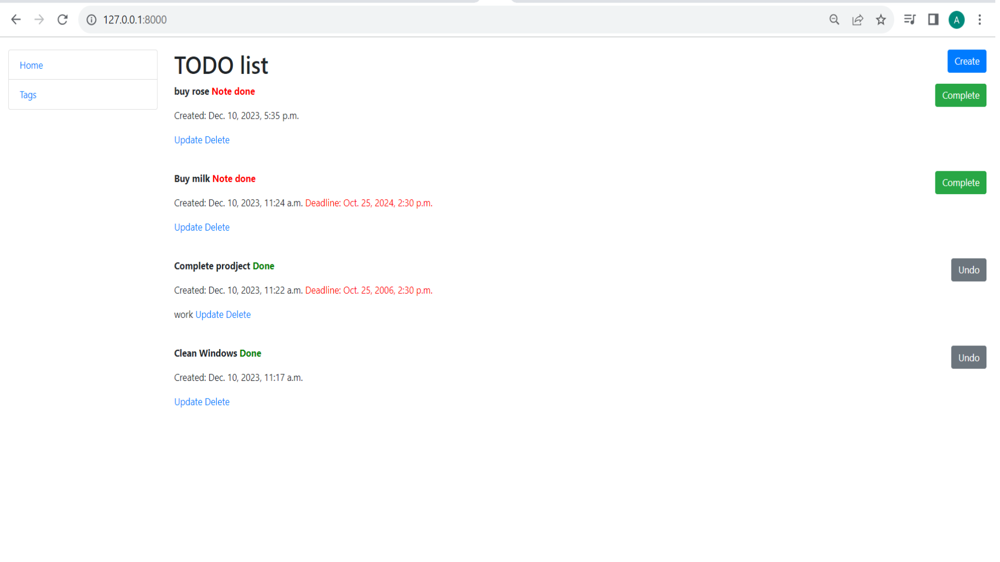
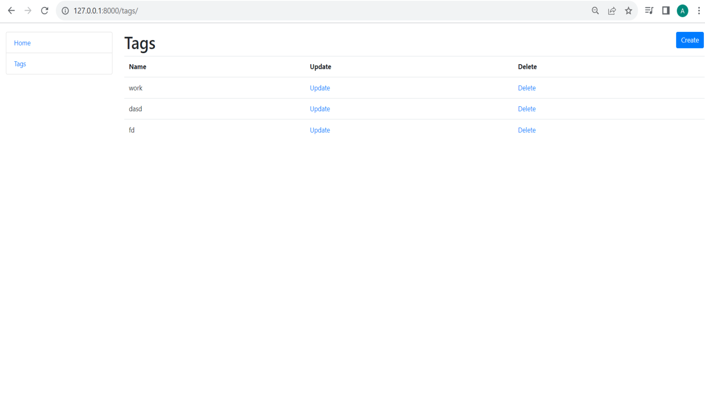

# Alex Wood
There's a department called Wood at the Alex Wood plant. It is assigned tasks with a time limit for completion. It is possible to mark whether the task is completed or not. These tasks are located in tags.
           

## <center >Manual Build</center>
1. In Pycharm, open the folder where the project will be stored.
2. Cloning the project.  
    ```shell
    git clone https://github.com/AnatoliyPilipey/Home-API.git
    ```
3. Go to the folder with the project.  
    ```shell 
    cd Home API
    ```
4. Creating a virtual environment.  
    ```shell 
    python -m venv venv
    ```
5. Activating the virtual environment.  
    * For Apple 
    ```shell     
    source env/bin/activate
    ```
    * For Windows  
    ```shell 
    venv\Scripts\activate
    ```
6. Install the required modules from the specified list.  
    ```shell 
    pip install -r requirements.txt
    ```
7. Create an .env file and put the secret key in it.  
    ```shell 
    DJANGO_SECRET_KEY = 'django-insecure-ll+%l1!&&xks&7(f33)u_u760_me^k7$$@2%9i=lndttv)4*u8'
    ```
8. Perform database creation migrations.  
    ```shell 
    python manage.py migrate
    ```
9. Using the fixture with test data, we fill the database.  
    ```shell 
    python manage.py loaddata db.json
    ```
10. Running the server  
    ```shell 
    python manage.py runserver
    ```
11. At this point, the app runs at  
    ```shell 
    http://127.0.0.1:8000/
    ```
## Demo



